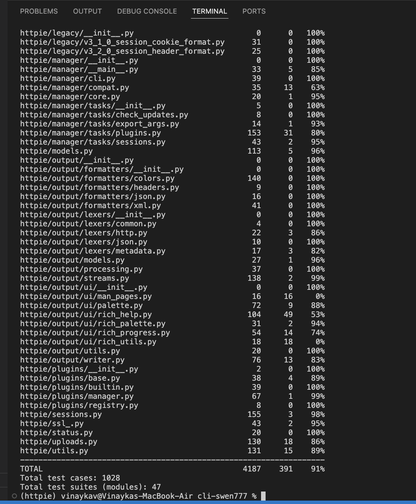

# Setup and Running Testability Metrics

## Setup Instructions

1. Clone the repository

   - git clone your-repo-url
   - cd cli-swen777

2. Install dependencies and setup environment

    - make

    The above command will:
    - Create a virtual environment inside ./venv
    - Install all dependencies
    - Install HTTPie in editable mode
    - Run the test suite once

3. Activate the virtual environment

    - source venv/bin/activate

4. Run the testability metrics script

    - python3 courseProjectCode/Metrics/Testability.py

    The above command will:

    - Run all tests with coverage enabled
    - Generate a coverage report
    - Output the total number of test cases and test suites

