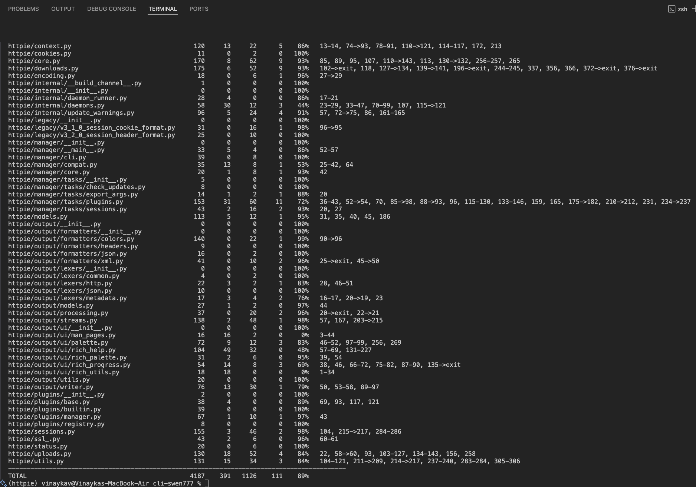
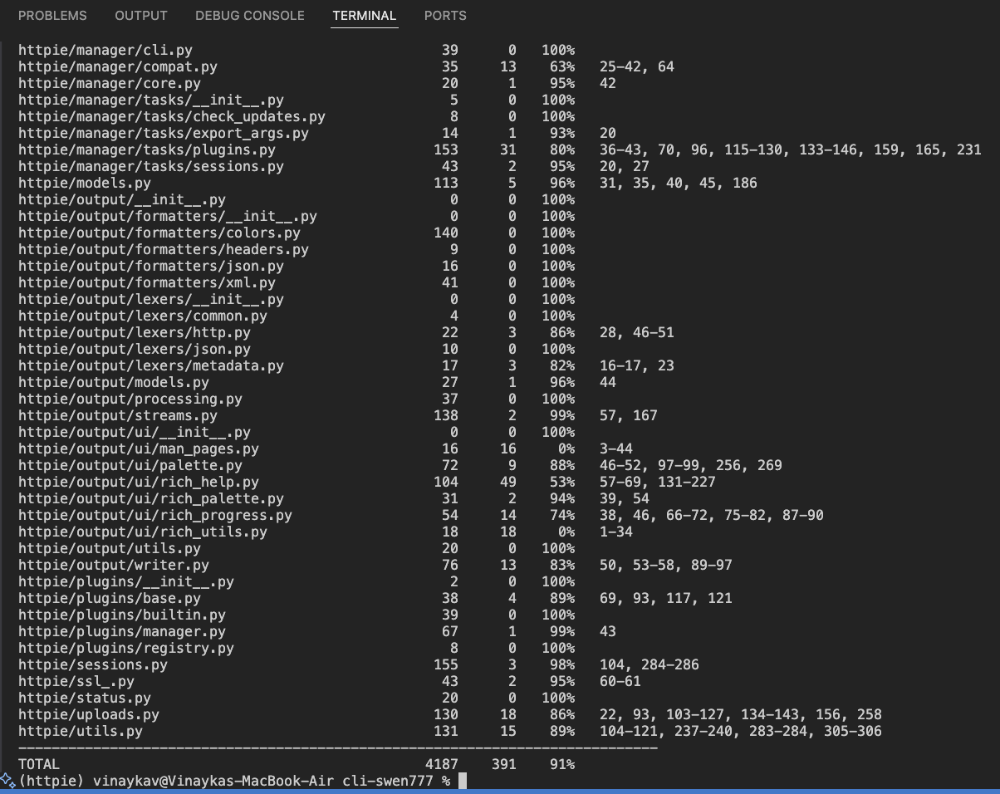

# Test suite summary

* Unit tests: These are the vast majority of tests we see in Httpie, these cover base functionality such as authentication/authorization, parsing user input, raising proper exceptions, and connecting to external services. These tests often do not include mocking.
* Integration tests: These tests validate the behaviour between the CLI against HTTP endpoints to confirm if the features work together correctly. One such example would be testing the authentication which sends requests to the mock up server with credentials and check that the server responds with authenticated access. 
* UI tests: While there is no "UI" specifically, the terminal acts as a UI as this is where all of the user interaction will take place. The UI tests themselves involve parsing input, displaying proper output, output formatting, and handling utf conversions. These tests often involve a mock environment and dummy URL's
* Regression: While there are no tests explicitly labeled as regression tests, we found references to regression testing through release documentation and git history. This indicates that certain tests have been implemented that implicitly prevent regression while serving a different explicit purpose 

# Metrics and observations

* Number of tests run - 1028
* Number of tests passed - 1020
* Number of tests failed - 3
* Number of tests skipped - 5

# Branch coverage summary

# Steps to get the branch coverage

* Run the below commands: 
    - coverage run --branch --source=httpie -m pytest
    - coverage run -m

* Branch coverage percentage: 89

# Steps to get the Statement coverage

* Run the below commands: 
    - coverage run --source=httpie -m pytest
    - coverage run -m

* Statement coverage percentage: 91

# Observations

1. Since the tests are dependent on external services, we observed inconsistency in the test results where we running the tests back to back gave different results and also different results on windows and mac. 
2. The documentation is designed around a unix based system (bash), which raised errors when running the same on a windows based system (powershell). 

