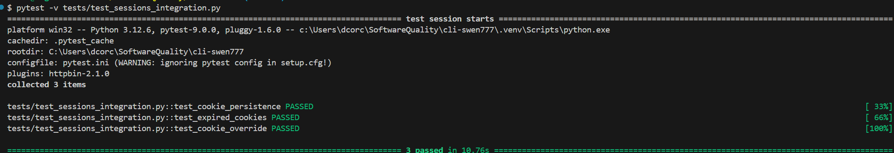

# Integration Testing Report

## Summary

Three new integration tests have been added, verifying logic interactions between `sessions.py`, the session handler, and `core.py`, the primary controller for HTTP functionality. `core.py` was the primary file we decided to test integrations with, since it effectively touches or is touched by most functional files in HTTPie. We then chose `sessions.py` because of the ease of testing persistence and our familiarity with the file from prior assignments.

Minimal test data preparation was needed, as we are creating cookies during testing and verifying they exist in an HTTP server we generated. Our tests ran as expected, verifying that HTTPie handles servers, sessions, and cookies properly, but only on certain machines. We found that potential mismatches between http or HTTPie versions can cause a catastrophic testing failure due to deprecated response methods. In older versions of this codebase, `core.py` expected responses to contain a sequence or tuple of bytes as a first argument, whereas newer versions accept strings. While this is not a defect of the current codebase, this does suggest that legacy systems and users will have to undergo refactors for request and response logic when updating to newer HTTPie versions.

## Test Results

## test_sessions_integration.py

1. `http_server()`
    -  This function is used for setup and generates an HTTP server. This server is given a default cookie upon spinning up and a definition to return the cookie when requested. The server runs in its own thread and is cleaned up automatically after each test.

2. `run_httpie()`
    - This function is used for setup and invokes HTTPie's CLI commands as subprocesses. This is used to pass arguments to HTTP commands and captures output, errors, and return codes for our test assertions. This serves as the integration testing point between core and sessions.

3. `test_cookie_persistence()`
    - This test verifies that cookies returned from the server are persisted in a session file and can be reused in multiple requests. This creates a session, sets a cookie, verifies the cookie has been persisted, and verifies that the cookie data matches between all requests. This tests how the requests from core interact with the read and write functionality of session cookies.

4. `test_expired_cookies()`
    - This test confirms that expired session cookies cannot be retrieved. This creates a session containing an expired cookie, requests all session cookies, and verifies the expired cookie cannot be retrieved. This tests the cookie filtering functionality from sessions and how that hides information from core requests.

5. `test_cookie_override()`
    - This test verifies that CLI cookie override requests are properly processed and that session and server cookies are properly updated. This creates a session with a pre-existing cookie, sends an override requests for that cookie, verifies that the old cookie has been updated with a new value, and verifies that other cookies have remained unchanged. This tests the interactions between CLI logic and requests from core and cookie, server, and session persistence within sessions.

# Group Contributions

| Member   | Task                                              | Notes                                                                                                                                                                                                                               |
| -------- | ------------------------------------------------- | ----------------------------------------------------------------------------------------------------------------------------------------------------------------------------------------------------------------------------------- |
| Vinayaka | Created the test cases and updated documentation  | None     
| Chris    | Created the test cases and updated documentation  | None                                                                                                                                                                                                                                |
| Dan      | Created the test cases and updated documentation  | None                                                                                                                                                                                                                                |
