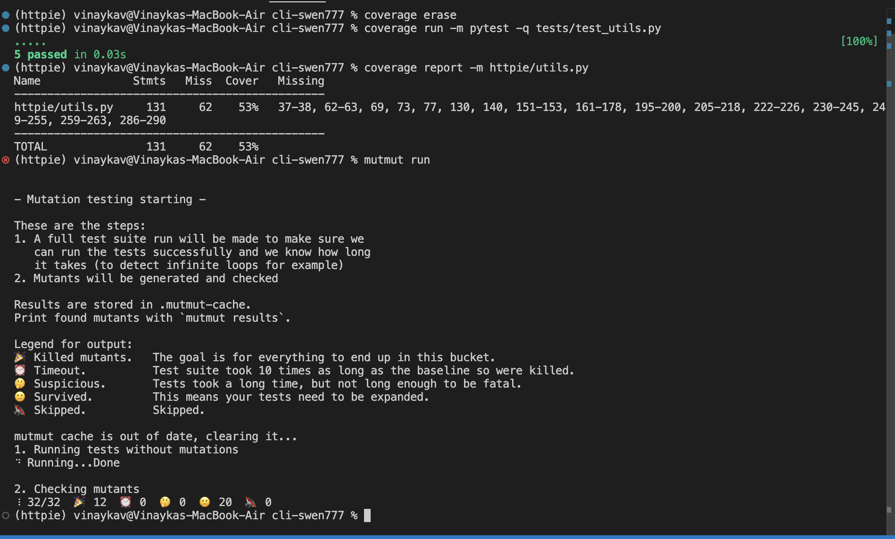
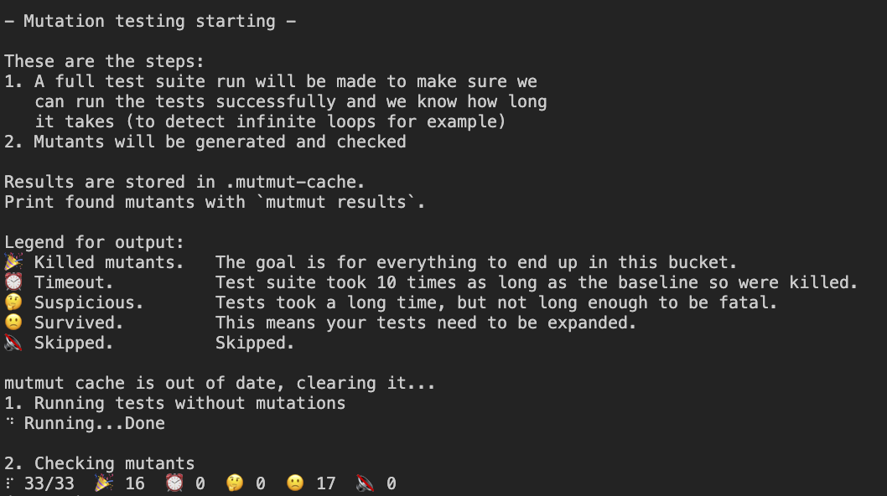

# Mutation Tool

We are using the mutmut python mutation testing tool, specifically we are running it on the httpie/utils.py file.

# Initial Score

Out of 32 mutants created, the test cases killed 12/32 leaving 20 still surviving.



# Final Score

Out of 33 mutants created, the test cases killed 16/33 leaving 17 still surviving.



# Test Cases Added

1.

```
def test_split_cookies_raises_if_regex_is_none():
    result = utils.split_cookies("foo=bar, name1=name2")
    assert result == ["foo=bar", "name1=name2"]
```

2.

```
def test_url_as_host_strips_userinfo_basic():
    assert url_as_host("http://example.com"/) == "example.com"
```

3.

```
def test_url_as_host_uses_last_segment_when_multiple_ats_in_userinfo():
    assert url_as_host("http://example.com:8080/path") == "example.com:8080"
```

# Mutants Killed

-   Mutant 1 was killed by Test Case 1. The variable `RE_COOKIE_SPLIT` was altered into being another regex expression. The function which uses the variable, `split_cookies()` was never tested, so by adding a simple test case the mutants are killed.
-   Mutant 19 was killed by Test Case 2.The `url_as_host()` function’s string split logic on '@' was altered, causing incorrect host extraction. Adding a test with a URL containing user info (e.g., user:pass@example.com) detected the issue.
-   Mutant 20 was killed by Test Case 3.It modified the index used after splitting on '@', returning the wrong part of the URL. A test verifying correct host extraction ensured the mutant was killed.

# Group Contributions

| Member   | Task                                              | Notes                                                                                                                                                                                                                               |
| -------- | ------------------------------------------------- | ----------------------------------------------------------------------------------------------------------------------------------------------------------------------------------------------------------------------------------- |
| Vinayaka | Setup and ran the mumut tool on the utils.py file | This was a very difficult process since running mutmut initially on the entire project would have taken 60 hours, so we had to configure it to work only with one file. We ran into many issues here but were successful in the end |
| Chris    | Created the test cases and updated documentation  | None                                                                                                                                                                                                                                |
| Dan      | Created the test cases                            | None                                                                                                                                                                                                                                |
