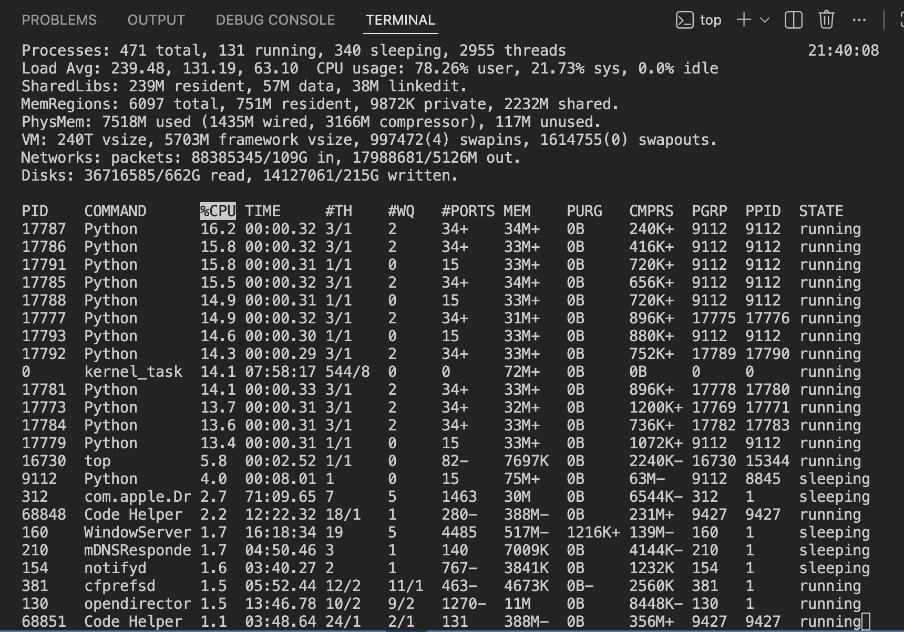
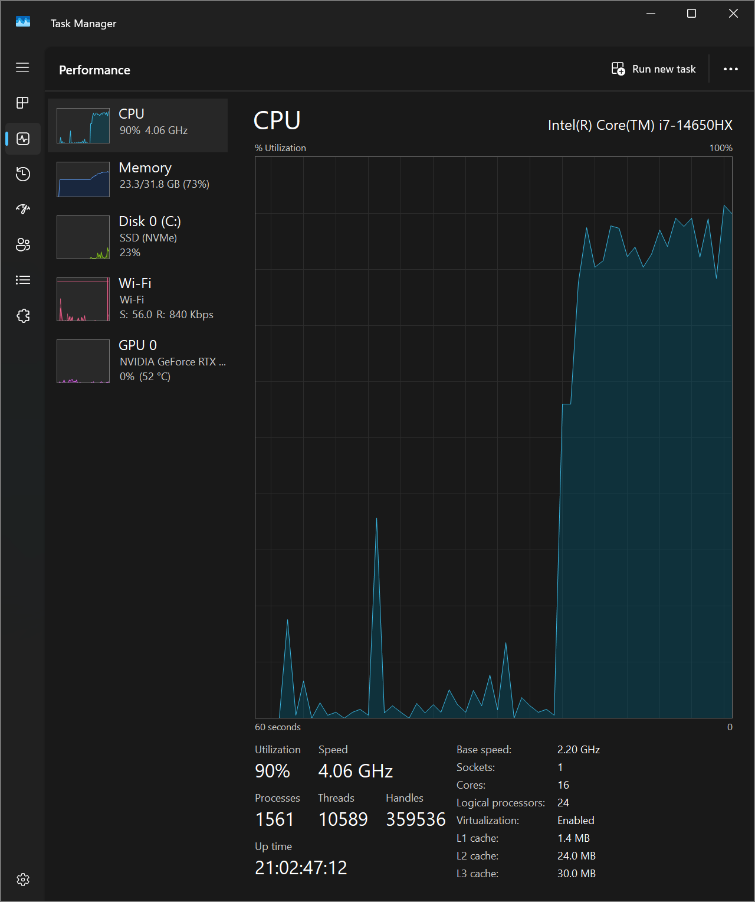
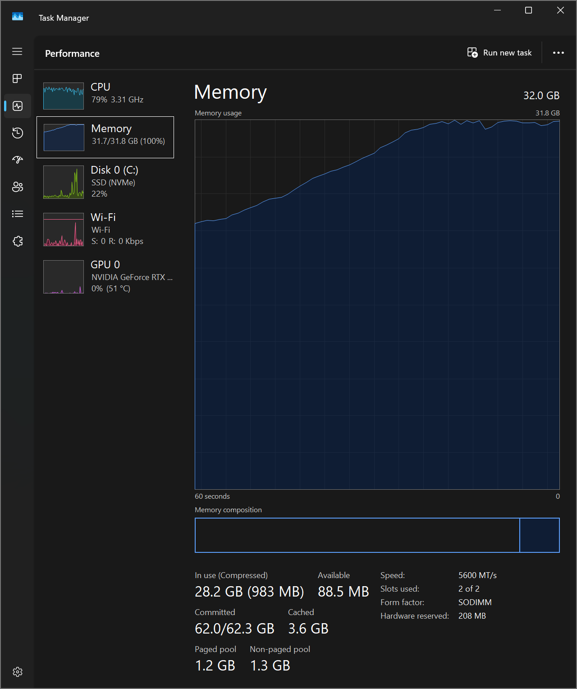
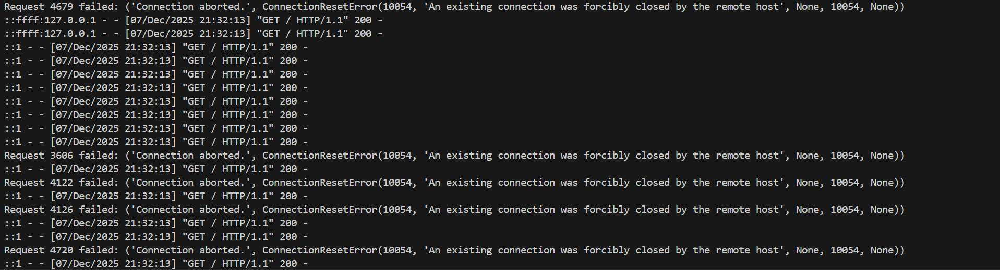
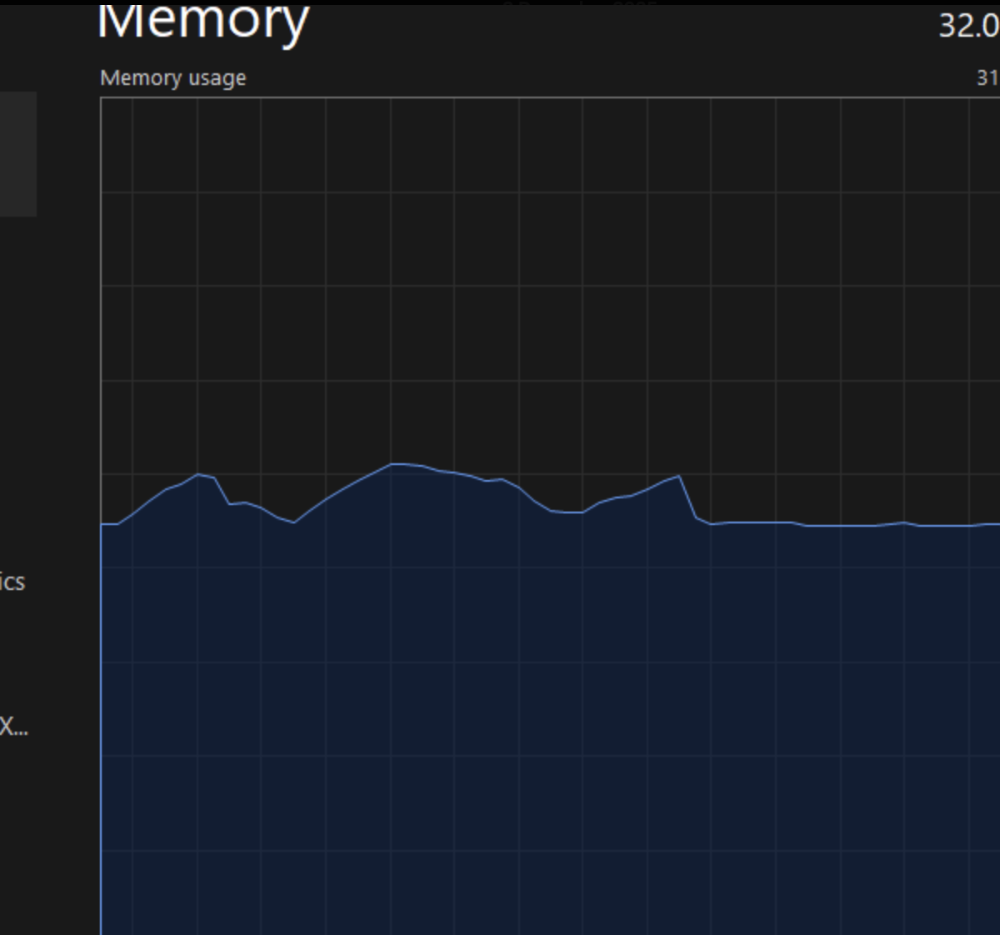
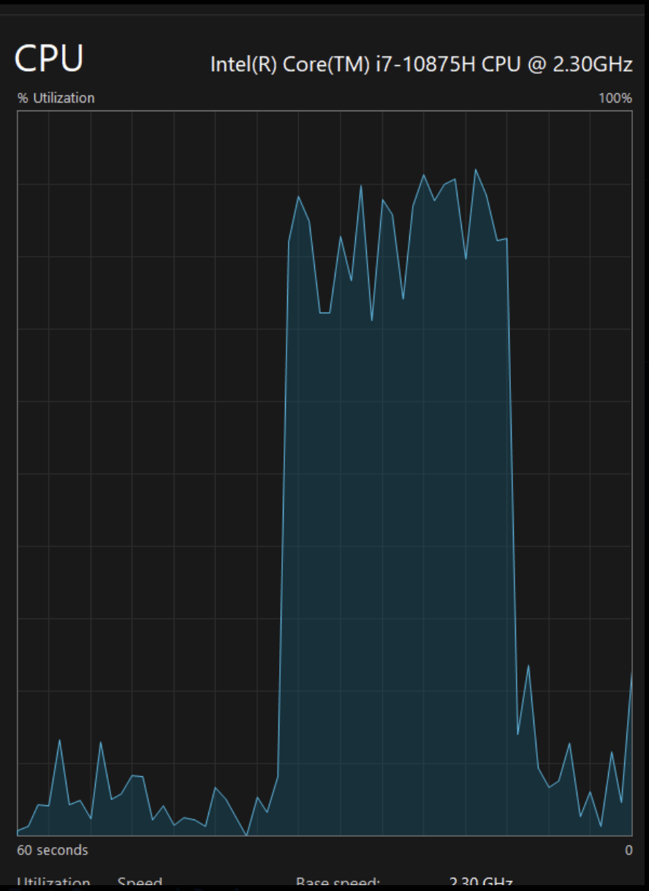

# Load Testing

#### Test Scope and Design

The purpose of this load test is to evaluate how the HTTPie CLI performs under a gradually increasing and then sustained level of load. To perform this test, we invoked the HTTPie CLI repeatedly against a local mock endpoint served by httpbin: `http GET http://127.0.0.1:5000/get`. We used Locust to collect metrics. Because HTTPie is a CLI tool each Locust user invoked HTTPie using subprocess.run() and manually recorded timing via Locust’s request events.

#### Configuration

- Start local mock server - python -m httpbin.core
- locust -f locustfile.py --headless -u 30 -r 3 -t 5m --csv=httpie_load
This configuration creates stable, sustained load, allowing us to measure steady-state behavior over time.

#### Results

#### Performance Findings

1. HTTPie maintained ~9–11 requests per second across several minutes with 30 active users.
2. Zero failures across 1980 requests even with sustained load for ~5 minutes there was 0 exceptions and 0 failed CLI invocations. This shows HTTPie is robust under concurrent automated execution.
3. Latency increases significantly as users ramp up. Median rises from near 0 ms to ~2200 ms.
4. CPU-Bound Performance Behavior:

- Multiple Python processes (Locust workers + HTTPie subprocesses) consumed 14–17% CPU each
- Overall system CPU utilization reached approximately 78% during steady state

It is important to note that this value represents total system CPU usage, not just the test processes. However, the load test contributed significantly to this increase: spawning many Python subprocesses, executing HTTPie repeatedly, and running the local httpbin server all add measurable CPU load.

# Stress Testing

#### Test Scope and Design

The purpose of this load test is to evaluate how the HTTPie CLI performs under edge case levels of traffic, ranging from gradual increases over time to sudden spikes in requests. To perform this test, we start a basic python server and start the three tests found in `tests/stess_tests_volatile/stress.sh`, with each simulating a different stress environment. Locust and aiohttp were leveraged for testing, with performance being monitored through task manager and general feel of the OS during simulations.

#### Configuration

- Start virtual environment
- pip install aiohttp locust httpie
- Comment or uncomment tests as needed in `tests/stess_tests_volatile/stress.sh`
- ./tests/stress_tests_volatile/stress.sh
The script will begin (and eventually close) all servers required and run any tests, with outputs being piped to the terminal.

#### Results

#### Performance Findings

1. Flooding HTTPie with 10000 requests in quick succession caused notable performance degredation, including a system crash during one trial. This crash was not replicated across 3 other trials however. All requests, outside of the crashed trial, were properly received and responded to.

2. Spiking HTTPie with 5000 simultaneous requests caused no notable performance degredation or any lasting complications, but resulted in large failures on numerous threads (upwards of 30%). Many threads were turned away, indicating that HTTPie is not a sufficient tool for testing large sites under heavy load, such as shops during cyber Monday.

3. Simulating a rampup of 125 new user connections per second, up to 500, for 30 seconds total, was moderately successful, with only 6 requests failing by the end of the process. Performance degredation was particularly heavy during this process, maxing out 32gb of RAM and spiking CPU usage to ~90%, indicating either a flaw with HTTPie or with locust's spawning of users.

Overall, HTTPie performed mostly as expected during stress testing, cementing itself as a testing and debugging tool for developers and not suitable for anything at scale. For testing simple endpoints or checking for race conditions across <10 users, this is a great tool. Anything beyond those types of use cases will result in failures that may be incorrectly attributed to source code, rather than cli testing.

# Spike Testing

#### Test Scope and Design

In order to perform Spike Testing on the HTTPie CLI we needed to hit any of the endpoints and measure its response time as we give it sudden bursts of load. To simulate these sudden bursts, we hit the endpoint with many users making many requests, we then stop the test, and run it again.

Specifically we hit the standard `/get` endpoint which returns nothing, while this was occuring we kept track of failure rate, error rate, and response time.

We utilized the `locust` tool to do so. This tool runs in the command line based on a `.py` file and collects metrics until the process is killed. This tool also allows us to generate reports of the findings for later analysis

#### Configuration

1. Run `python -m httpbin.core` in the project root, this spins up a mock server
2. Run `locust -f locust.py --headless -u 50 -r 50 --run-time 30s --csv spike_results`. This runs the code found in the `locust.py` file which makes the results. `-u` is for 50 users. `-r` is for 50 requests. We run this for 30 seconds and save the results to a csv file. Run this command, stop the results, and then run it again to simulate the spikes

To add additional load to the system the `-u` and `-r` flags can be increased to make the spike bigger and bigger.

#### Results

The following chart details the findings output from the `locust` program. What we see is that our response time starts out low, and then increases before decreasing as the load is removed towards the end of the spike. This shows us the httpie cli is senstive to spikes in load and performance does decrease. More of these results can be found in the `spike_results_stats_history.csv`. The 0 second response time at the start also shows the spike in action, as nothing occurs, and then we have a sudden spike before dropping back down. If the same command were run again, the same pattern would be seen

| Request | Users | Response Time (s) |
| ------- | ----- | ----------------- |
| 1       | 0     | 0                 |
| 2       | 50    | 1.13              |
| 3       | 50    | 3.44              |
| 4       | 50    | 8.1               |
| 5       | 50    | 5.4               |
| 6       | 28    | 5.1               |

#### Performance Findings

When looking at memory and CPU usage, we can see a better idea of what these spikes look like, in general HTTPie CLI is more CPU intensive. This makes sense because the requests are not storing anything in memory they are simply being performed and the result is sent back to the user.

When looking at the memory graph we can see some small spikes in memory before dropping back down, at idle the memory usage sits at 55%, when running the spike test it increases to 61%.

When looking at the CPU graph we see a much larger spike before dropping back down, at idle the CPU usage sits at 4%, when running the spike test it increases to 99%. This is most likely where all of the performance issues are coming from, but it does indicate that with a stronger system HTTPie CLI is more performant.

# Group Contributions

| Member   | Task                                                 | Notes |
| -------- | ---------------------------------------------------- | ----- |
| Vinayaka | Performed the Load Testing, added notes to document | None  |
| Chris    | Performed the Spike Testing, added notes to document | None  |
| Dan      | Performed the Stress Testing, added notes to document | None  |
