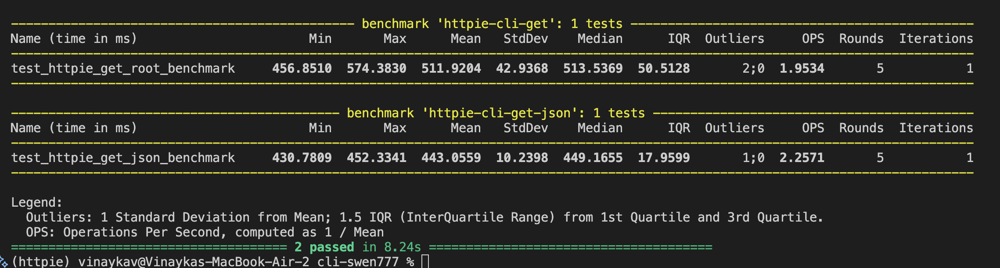

# NOTE
This document was created prior to the performance testing assignment updates and contains outdated and incomplete information. Please see `performance.md` for the full performance testing information and analysis

# Performance Testing

For performance testing, we used pytest-benchmark, a Python benchmarking tool that integrates with pytest. We focused on the core user flow of HTTPie, running a command like - `http GET URL`. This is the most comman way real users interact with HTTPie. To test this we measuered two scenarios: 
1. GET request to the root endpoint (/)
2. GET request to a JSON endpoint (/json)

Each test runs the full HTTPie CLI pipeline, including argument parsing, request construction, sending the HTTP request, receiving the response, and formatting the output.

The main performance concerns we targeted were:

- Response time – how long one HTTPie command takes to complete.

- Throughput – how many HTTP requests per second HTTPie can make when used through the CLI.

## Performance Results

Here each HTTPie CLI call takes roughly 0.4–0.5 seconds. JSON endpoint was slightly faster. Throughput was approx 2 operations/second.

## Bottleneck Analysis

## Group Contributions

| Member   | Task                                                                                                         | Notes |
| -------- | ------------------------------------------------------------------------------------------------------------ | ----- |
| Vinayaka | Set up the performance testing environment, wrote one benchmark test, and documented its results.                            | None  |
| Chris    | Wrote the second benchmark test, helped run the benchmarks, and verified the collected metrics. | None  |
| Dan      | Summarized the performance results, contributed to the bottleneck analysis, and added the final findings to the report.                              | None  |