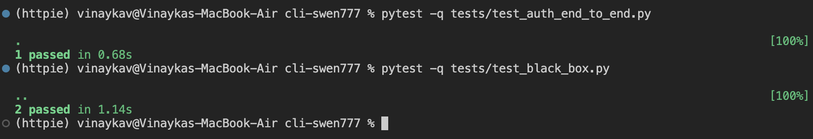

# System Testing Report

## Summary

Three new system tests have been added, 

## Test Results

## test_black_box.py

1. `test_httpie_get_flow()`
    * Preconditions: Ensure that HTTPie is installed. In the command line type in `which http`, if an error pops up that means it is not installed correctly. You can run the command `pip install httpie` to do so.

    * Test Steps: Validate the HTTPie is installed correctly, start a mock server, use the HTTPie CLI to make a GET request to that mock server, shutdown the mock server, validate that the response from the server matches what we expect.

    * Expected Results: 200 HTTP code, JSON object with a message of "Hello from mock server", no error messages.

    * Test Scope: This test validates the main HTTPie workflow of making an HTTP request with their CLI (http). This code does not use any internal HTTPie functions and only interacts with the system through the CLI. THis workflow works as intended and there are no behavior deviations.

2. `test_httpie_invalid_url()`
    * Preconditions: Ensure that HTTPie is installed. In the command line type in `which http`, if an error pops up that means it is not installed correctly. You can run the command `pip install httpie` to do so.

    * Test Steps: Validate the HTTPie is installed correctly, use the HTTPie CLI to make a generic request to an invalid local URL, validate that the response from HTTPie matches what we expect.

    * Expected Results: HTTP error code (400, 404, 410, etc.) and an error messsage stating a failed connection.

    * Test Scope: This test validates the main HTTPie error handler of making an HTTP request with their CLI (http) to a bad URL. This code does not use any internal HTTPie functions and only interacts with the system through the CLI. This workflow works as intended and there are no behavior deviations.

## test_auth_end_to_end.py

1. `test_httpie_basic_auth_flow()`

* Preconditions: Ensure that HTTPie is installed by running `which http` in the command line. If not installed, use `pip install httpie`.

* Test Steps: Validate that HTTPie is installed, start a mock server requiring Basic Auth, run the HTTPie CLI using --auth user:pass to access the secure endpoint, shut down the server, and validate that the response matches the expected successful authentication behavior.

* Expected Results: HTTP status code 200 OK, JSON object with "message": "Authenticated", correct headers, and no error output.

* Test Scope: This test verifies that HTTPie correctly handles Basic Authentication when using the CLI. It does not import any internal HTTPie modules and interacts only through the CLI, validating a core E2E workflow.

# Group Contributions

| Member   | Task                                              | Notes                                                                                                                                                                                                                               |
| -------- | ------------------------------------------------- | ----------------------------------------------------------------------------------------------------------------------------------------------------------------------------------------------------------------------------------- |
| Vinayaka | Created the test cases and updated documentation  | None     
| Chris    | Created the test cases and updated documentation  | None                                                                                                                                                                                                                                |
| Dan      | Created the test cases and updated documentation  | None                                                                                                                                                                                                                                |
